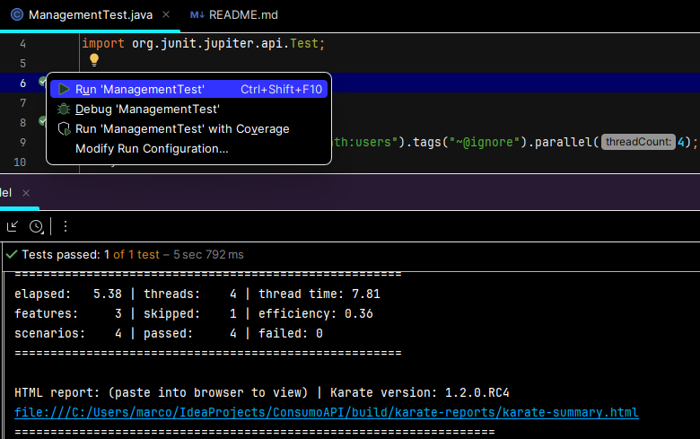

# ¡Reto Automatizador! 🚀

Este es un proyecto de automatización de pruebas de consumo de APIs

Las pruebas están centradas en el sitio web https://petstore.swagger.io/ con los siguientes escenarios:

• Añadir una mascota a la tienda

• Consultar la mascota ingresada previamente (Búsqueda por ID)

• Actualizar el nombre de la mascota y el estatus de la mascota a “sold”

• Consultar la mascota modificada por estatus (Búsqueda por estatus)

## Pre requisitos para ejecutar 📋
- Java version "19.0.2" 2023-01-17 o superior y JDK (variables de entorno configuradas).
- IntelliJ IDEA
- Gradle version 8.3 (variables de entorno configuradas).

## Ejecutar pruebas 🔨

La automatización está parametrizado para que se realice la ejecuciòn en paralelo, 
por lo cual solo se requiere ejecutar la clase ManagementTest del archivo ManagementTest.java

El reporte del resultado de la ejecución podrá encontrarlo en la siguiente ruta:
/build/karate-reports/karate-summary.html

## Navegador Web 🌐
Actualmente la automatización ejecuta por defecto con Chrome.

## Obtener el código

El código de la automatización está alojado en un repositorio de GitHub, para hacer uso de él puede clonarlo usando Git o descargar el archivo zip del proyecto.

Git:
https://github.com/marcoviniciohc/

## Versionamiento 📌
Se usó Git para el control de versiones. 🔀

## Autor 👨
**Marco Herrera**
